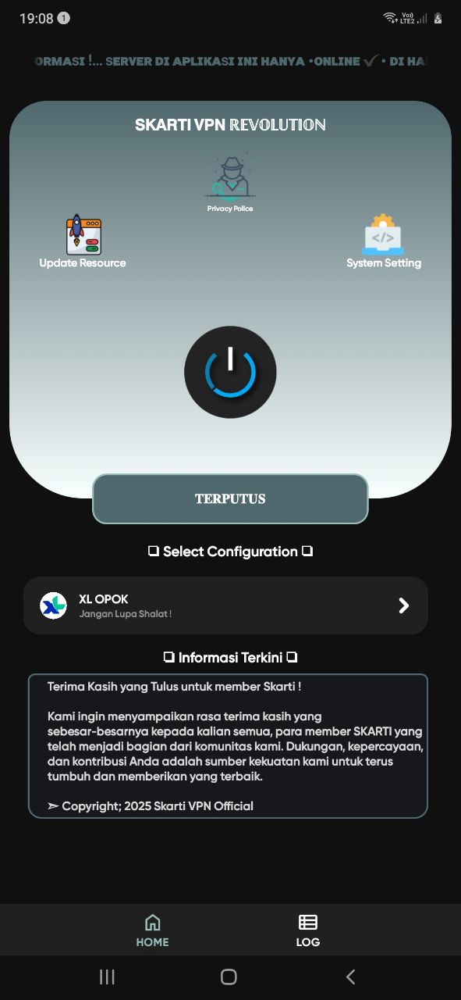

# README

## 📸 ScreenShot

  

## 📱 Tentang Aplikasi Skarti VPN
Skarti VPN Revolution adalah aplikasi yang digunakan untuk mengonfigurasi koneksi internet melalui protokol HTTP, biasanya untuk kebutuhan inject, Tunnel, bypass atau optimisasi jaringan.

## 🎯 Fitur Utama
- UI Sederhana.
- Gratis dan Mudah Digunakan.
- Mendukung Protokol SSH, UDP, V2ray.
- Meningkatkan Privasi,memungkinkan lalu lintas dienkripsi, membantu melindungi data pribadi pengguna dari pengintaian oleh pihak ketiga atau ISP.

## 📦 Instalasi
1. Unduh file APK nya terlebih dahulu, lalu Install.
2. Pastikan Anda memiliki koenksi internet untuk melakukan "Update config".
3. Buka aplikasi dan nikmati fiturnya!

## 🛠 Teknologi yang Digunakan
- **Aplikasi**: AndroidIDE
- **Bahasa Pemrograman**: Java

## 📄 Lisensi
Proyek ini dilisensikan di bawah lisensi [SocksHTTP]. Silakan baca file `LICENSE` untuk detail lebih lanjut.

## 🌐 Komunitas dan Dukungan
Jika Anda memiliki pertanyaan atau masukan, jangan ragu untuk bergabung dengan komunitas kami:
- Email: sktv1@catgroup.uk
- Telegram: https://t.me/SaputraTech
- Group Chat: https://t.me/PhreakersVPN

---

Terima kasih telah menggunakan aplikasi kami! Kami berharap dapat terus meningkatkan pengalaman Anda.

